# ETGS: Explicit Thermodynamics Gaussian Splatting for Dynamic Thermal Reconstruction
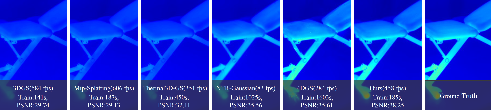

ETGS achieves high-quality rendering of dynamic thermal scenes with efficiency
comparable to static methods.

## Setup
Clone this repository and set up the environment with the following command:
```
git clone git@github.com:jankin-wang/ETGS.git
cd ETGS

conda create -y -n etgs python=3.8
conda activate etgs

pip install torch==1.12.1+cu113 torchvision==0.13.1+cu113 -f https://download.pytorch.org/whl/torch_stable.html
conda install cudatoolkit-dev=11.3 -c conda-forge

pip install -r requirements.txt

pip install submodules/diff-gaussian-rasterization
pip install submodules/simple-knn/
pip install submodules/fused-ssim
```

## RHD Dataset
Please download the RHD dataset from [RHD_DATA](https://huggingface.co/datasets/jankinkin/RHD_dataset/tree/main) and place it in the `./dataset` folder under the project directory.

### Each Scene of the RHD dataset
|   Scene  | RGB<br>(visible) | Thermal<br>(original) | Thermal<br>(pseudo) | views | Temp.<br>Range(°C) |  Time<br>Range(s) |  Env.<br>Temp(°C) |
| :------: | :-----: | :------------------: | :------------------: | :------------------: | :------------------: | :------------------: | :------------------: |
|  Cooling Checkboard | 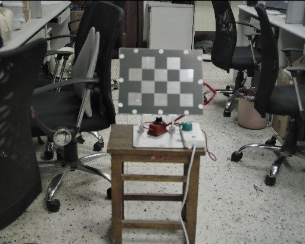 || 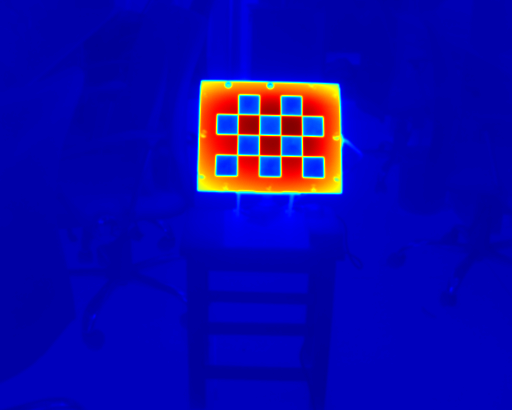 | 218 | 20.0<br>72.0 | 2145.488 | 26.5
|  Cooling Dumbbels   | 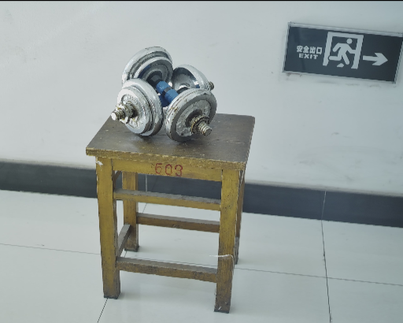 | | 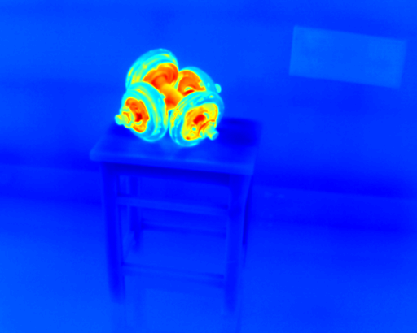 | 210 | 28.0<br>46.0 | 2115.472 | 32.3
|  Cooling Bench |  | | 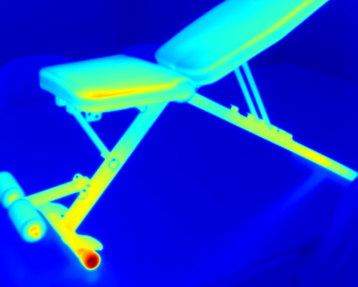 | 221 | 31.0<br>56.0 | 1689.206 | 32.9
| Cooling Ebike |  | |  | 315 | 26.0<br>60.0 | 1954.054 | 30.2
|  Heat Transfer  | 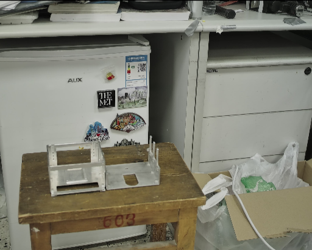 | | 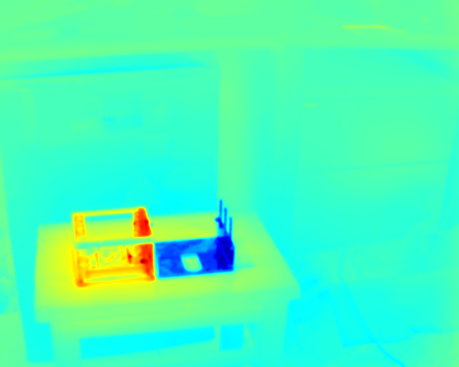 | 250 | 21.0<br>41.0 | 1730.072 | 26.4
|  Heating Workpieces  | 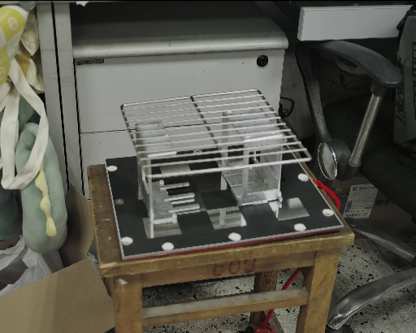 | | 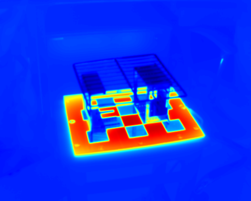 | 224 | 12.0<br>101.0 | 1249.084 | 26.9
|  Warming Bottles | 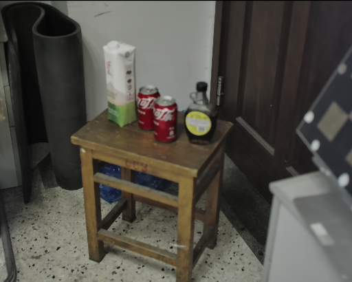 | | 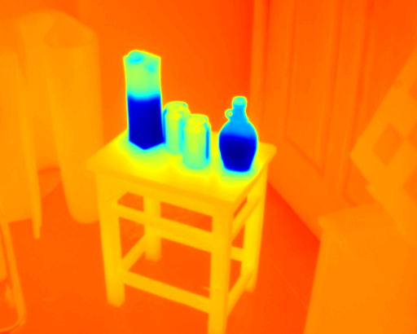 | 209 | 5.0<br>31.0 | 3988.082 | 26.6
|  Warming Cups  | 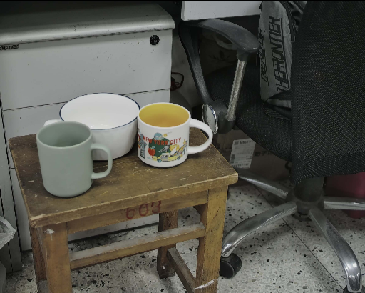 | | 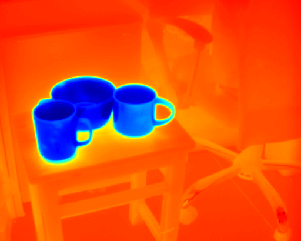 | 224 | -1.0<br>30.0 | 1678.116 | 26.9
|  Warming Peaches   | 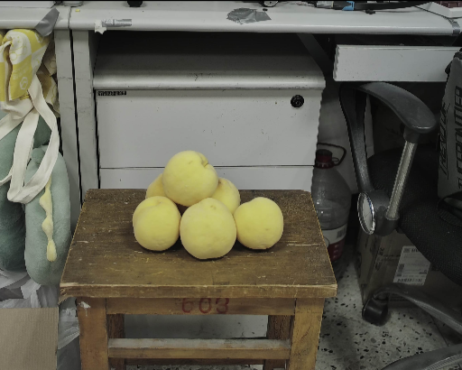 |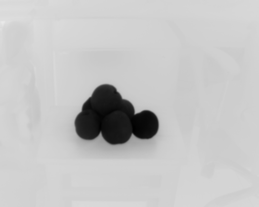 | 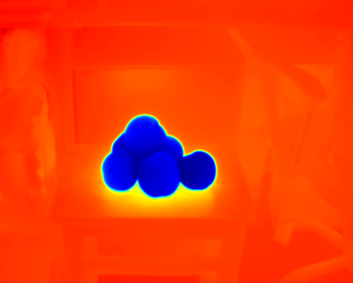 | 254 | 2.0<br>30.0 | 2284.465 | 26.9
|  Warming Workpieces | 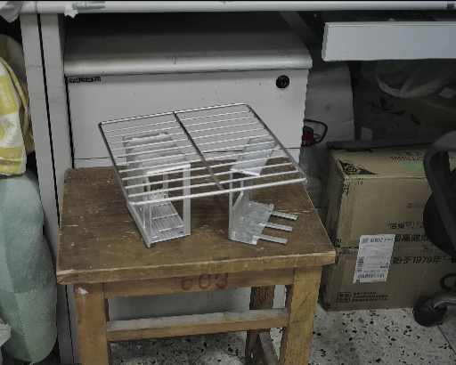 |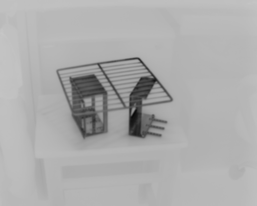 | 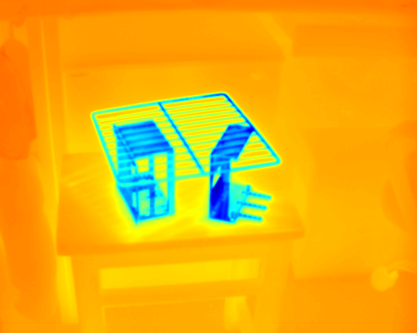 | 238 | 3.0<br>32.0 | 1554.317 | 26.9

### Directory Description
The RHD dataset is organized by scene. Each scene directory typically contains data in two modalities: visible light (`RGB`) and thermal infrared (`Thermal`), along with corresponding auxiliary files.

The image files follow the naming format:
```
HHMMSSmmm.png
```
where the 9-digit number is a timestamp code in the format:
- `HH: hour (00–23)`
- `MM: minute (00–59)`
- `SS: second (00–59)`
- `mmm: millisecond (000–999)`

Examples:
- `090512037.png → 09:05:12.037`
- `153824825.png → 15:38:24.825`
- `235959999.png → 23:59:59.999`


A typical directory structure is as follows:
```
datasets/
└── RHD/
    ├── cooling_bench/
    │   ├── rgb/
    │   │   ├── images/
    │   │       ├── 153824825.png
    │   │       ├── 153830191.png   
    │   │       ├── ...
    │   │       └── 160634031.png   
    │   │   └── sparse/0/
    │   │       ├── cameras.bin
    │   │       ├── images.bin
    │   │       ├── points3D.bin
    │   │       └── project.ini
    │   └── thermal/
    │       ├── images/
    │       ├── images_pseudo/
    │       ├── sparse/
    │       └── info.json
    ├── ...
    └── warming_workpieces/
```

## Quick Start
To start training, rendering and evaluating, simply use:

`python scripts/run_ETGS.py`

## Citation
If you find our work useful in your research, please consider citing:

```
@inproceedings{wangetgs,
  title={ETGS: Explicit Thermodynamics Gaussian Splatting for Dynamic Thermal Reconstruction},
  author={Wang, Zhongwen and Ling, Han and Zhang, Weihao and Sun, Yinghui and Sun, Quansen},
  booktitle={The Fourteenth International Conference on Learning Representations}
}
```
